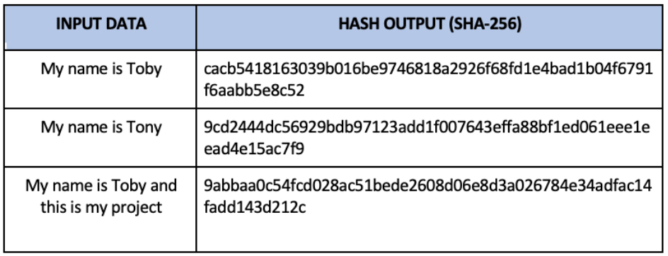

# **Python SHA256 Hashing Algorithm**
##  What is **SHA256** Hashing?
**SHA** stands for ***Secure Hash Algorithm***, which represent cryptographic hash functions. These functions have excellent uses in protecting sensitive information such as passwords, personal identifiers such as identification items.

**SHA256** uses a 256-bit key to take a piece of data and convert it into a new unrecognizable data string of a fixed length. This string of random characters and numbers, called a hash value, is also 256 bits in size.
[For More Information](https://en.wikipedia.org/wiki/SHA-2)

---

## What makes the SHA256 algorithm interesting is that:

- **It is a one-way algorithm, meaning the algorithm cannot be returned to its original value**

- **Any change to the input will change the output.** Even the smallest change to the input file will result in a change to the resulting hash value

- **The odds of “collisions” are low.** This mean two different input values will practically never yield the same result, allowing us to maintain integrity and uniqueness of data.

#Main Features:

---

#### **On this project I've used:**

- Module called "**hashlib**" which allows me to  use different hash algorithms in Python

- Loop

 
- Condition

- Nested Dictionary

- Function that return an output

- Lambda Function
