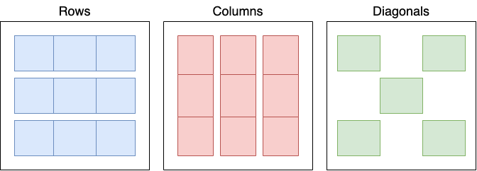

# Tic Tac Toe Project
## Overview:
**Tic Tac Toe** is a two-player game. In this game, there is a board with 3 x 3 squares. 
The two players take turns putting marks on a 3x3 board. 
The main goal of this game is to be one of the two players to get **three** symbols in a row - diagonally, horizontally, or vertically on the 3x3 grid. 

## Game rules: 
1. The first player who will play first with the "X" mark and the second player who will play second with the "O" mark. 

2. Players will take turns making their moves.

3. Any player who create a straight line diagonally, horizontally, or vertically will wins the game otherwise the game ends in a draw/tie.

### As a player I should be able to do the following:
- See the Tic-Tac-Toe game
- Enter his mark "X or O"
- See the game result

## Main Function
- Function to print Tic Tac Toe 
- Function to check if any player has won  or tied
- Function to check for move input

